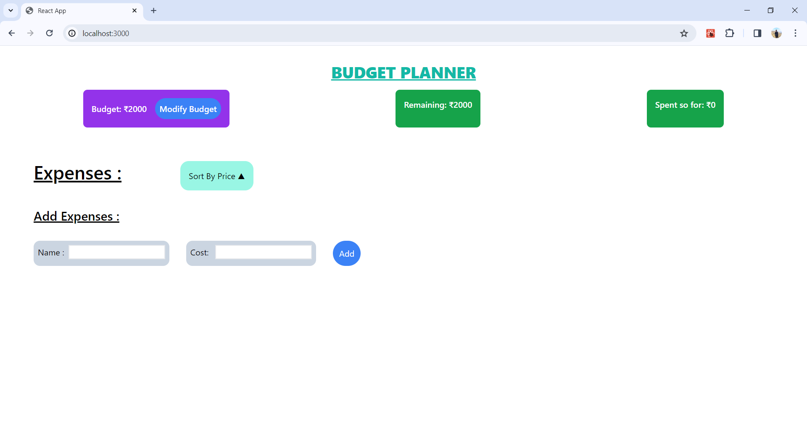

# React Budget Planner

  - The React Budget Planner is a simple web application built with React that helps users track their budget and expenses.

## [Hosted Link](https://budget-planner-taupe.vercel.app/)

### Features

  - Budget Tracking: Users can set their budget and track their expenses.
  - Expense Management: Users can add, edit, and delete expenses.
  - Sorting: Expenses can be sorted by price, either in ascending or descending order.
  - Responsive Design: The application is designed to be responsive and work well on various screen sizes.

### Technologies Used

   - React: A JavaScript library for building user interfaces.
   - React Context API: Used for state management across the application.
   - React Icons: Provides a collection of icons for use in the application.
   - Tailwind CSS: A utility-first CSS framework used for styling components.
   - UUID: Generates unique identifiers for expenses.

### Usage
   - Set your budget using the "Modify Budget" button in the Budget section.
   - Add your expenses using the form in the "Add Expenses" section.
   - View and manage your expenses in the Expenses section.
   - Expenses can be edited or deleted by clicking on the respective icons.
   - Expenses can be sorted by price by clicking on the "Sort By Price" button.

#### Screen Shots

  
  

